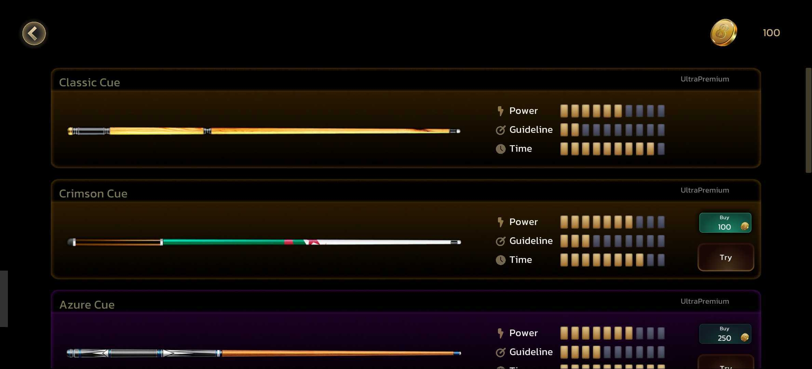

# Adding a Complex Progression System to a live game

### The Problem: No Replay Value

Our game launched with a simple progression model. Players used currency to unlock new levels, which led them to play their first game. When they unlocked the second level, they discovered the gameplay was identical - same cue, same mechanics, just a different table background

<figure><figcaption>
<em>Original home-screen had just a basic level unlock system with single cue</em>
</figcaption></figure>

&#x20;After trying a few matches, they had no reason to return because gameplay never changed. We needed to add depth to the game play

### How Hot Deploy Engine Enabled Live Cue Shop Addition

We knew players needed more gameplay variety to keep returning. Our plan was to add a Cue Shop system where players could upgrade three key parameters that would change how each match played - Power for shot strength, Guidelines for aiming assistance, and Time for how long they could plan shots.

We first added the Cue Shop entry point to our existing homescreen

<figure><figcaption>
New Cue Shop added to home screen
</figcaption></figure>

Users were repeatedly trying to click on the "cues" button displayed in-game. This confirmed our instinct was right. Players wanted cue customization. Then we created the full upgrade interface where players could customize their cue with different parameter combinations.

Then we rolled out the full upgrade interface where players could finally interact with cues and customize their gameplay experience.

<figure><figcaption>
A complete cue system rolled out with  Power, Guidelines, Time options
</figcaption></figure>

Hot Deploy Engine made this entire system addition possible **without requiring any app updates**. Players discovered the new progression system when they opened their game, transforming our simple level-unlock model into meaningful gameplay customization.

This complete system required new UI screens, purchase logic, gameplay modifications, and progression tracking - exactly the type of major feature addition that would traditionally need app store updates and risk fragmented player experiences.

### The Impact

Players now had meaningful strategic choices and clear progression paths. The currency economy transformed from cosmetic unlocks to gameplay-affecting decisions. Hot Deploy Engine made this substantial system addition seamless for our entire live player base, dramatically improving retention and engagement.
