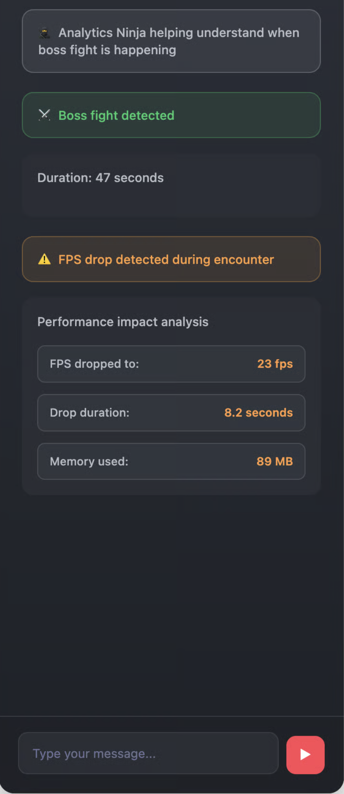
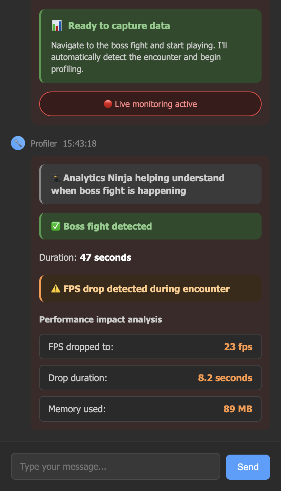
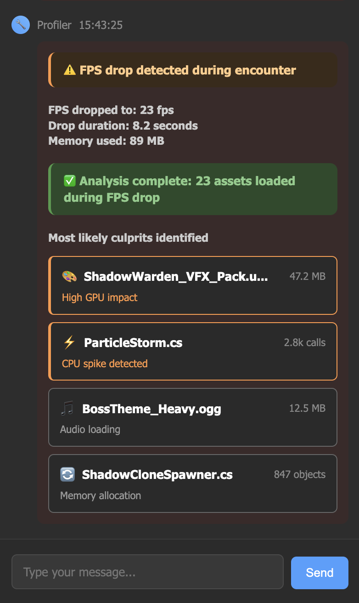

# 📊 Auto-Profiler


Type: _“The framerate drops in the boss fight — find the issue and suggest fixes.”_\
Profiler pinpoints the costly calls, highlights oversized assets, and proposes optimizations — from code tweaks to asset compression.


Auto Profiler is an intelligent performance analysis tool designed to reduce the complexity of Unity profiling. While Unity’s built-in Profiler is powerful, it often requires expert knowledge to interpret correctly, and sifting through performance logs can be time‑consuming. Auto Profiler streamlines this process by capturing performance data automatically and using AI‑powered analysis to highlight the most likely performance bottlenecks.

<a href="https://flow.letsterra.com/" class="button primary">Visit Website</a> <a href="https://cal.com/terra-demo/30min?overlayCalendar=true" class="button secondary">Schedule a demo</a>

***

### Feature Overview

In Unity, diagnosing performance issues typically means:

* Running the project in the Editor or on a target device.
* Attaching the Profiler and recording frame-by-frame data.
* Sorting through long lists of CPU, GPU, and memory samples.
* Manually identifying which spike or allocation is causing slowdowns.

This workflow is effective but requires specialized experience and can take hours of digging through logs. The problem is rarely fixing the issue itself—rather, it’s identifying what the issue actually is.

Auto Profiler addresses this by:

* **Capturing profiler snapshots automatically** from Play mode sessions in the Editor or during live tests.
* **Analyzing logs with AI** to flag the most probable root causes of performance issues, such as spikes in draw calls, CPU usage, RAM leaks, or FPS drops.

Instead of parsing hundreds of log entries, developers get a concise shortlist of actionable issues.

### Setting up the Auto-Profiler



#### Ask any question &#x20;

<figure><figcaption></figcaption></figure>



#### Auto-profiler is auto-selected for the task

Flow routes to Auto Profiler Assistant based on performance-related keywords

<figure><figcaption></figcaption></figure>



***

### The Two Profiling Modes&#x20;

Auto-Profiler offers two ways to hunt down performance issues:

#### Live Profiling Mode

**What it does:** Connects directly to your game while you're playing and catches performance problems in real-time.

**Best for:**

* Active development and testing
* When you can reproduce a specific issue
* Getting immediate feedback on performance changes

#### Player Data Mode

**What it does:** Analyzes your existing telemetry data to find patterns in what real players experienced.

**Best for:**

* Understanding what's happening to live players
* Investigating performance complaints you can't reproduce
* Analyzing trends across many player sessions
* When you have telemetry data but can't test locally

### Live Profiling Mode



### Choose Live Profiling&#x20;

Select the Live Profiling option if you want to live run the profiler

<figure><figcaption></figcaption></figure>




### System scans for devices on same network&#x20;

* Scans network for devices with debugging enabled
* Tries to establishes profiling connection

<figure><figcaption></figcaption></figure>



### Device detected

* Reads device specs (build version, available memory, connection status)
* Analytics Ninja monitors for gameplay event patterns

<figure><figcaption></figcaption></figure>



### **Detects FPS Issue**

* Hooks into Unity's profiler
* Monitors frame rate, memory allocation, asset loading in real-time
* Detects performance-critical events automatically
* Captures FPS metrics during detected events, records drop severity, duration, memory spikes.

<figure><figcaption></figcaption></figure>



### Culprits analyzed by AI&#x20;

* Cross-references loaded assets with performance drop timing
* Identifies scripts with high call counts during drops
* Ranks assets by performance impact (CPU/GPU/memory)

<figure><figcaption></figcaption></figure>



### Player Data Mode&#x20;



### Select Real Player Data&#x20;

Analytics Ninja searches telemetry database for recent player sessions matching criteria

<figure><figcaption></figcaption></figure>



### Let the system go through logs&#x20;

* Filters sessions by time window (last 3 hours)
* Extracts performance events from session logs
* Counts total sessions and relevant events

<figure><figcaption></figcaption></figure>




### Auto-shortlist most likely root cause&#x20;

<figure><figcaption></figcaption></figure> <figure><figcaption></figcaption></figure>




### Get a ready-made shortlist of potential rot causes

<figure><figcaption></figcaption></figure>



### What Auto-Profiler Does Behind the Scenes

* **Profiling Recorder:** Hooks into Unity’s ProfilerRecorder API to capture CPU, GPU, memory, and rendering metrics in the background.
* **Snapshot Management:** Organizes captured frames and stores representative samples for spikes.
* **AI Analysis Layer:** Runs models trained to detect anomalies such as sudden increases in draw calls, frame hitches, or repeated GC allocs.
* **Issue Mapping:** Connects anomalies to Unity objects (scripts, prefabs, or assets) for actionable debugging.
